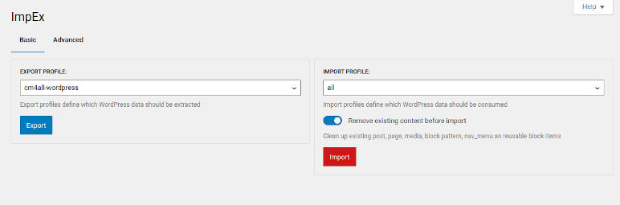

<!-- toc -->

# Preface

_This is a working-draft that has not been peer-reviewed. It is not yet complete and may change in the future._

# About

The ImpEx plugin provides a modern way to import and export data from WordPress.

It provides

- a [WordPress REST API](https://developer.wordpress.org/rest-api/) extension for importing and exporting data

- a WordPress admin page for interacting with the ImpEx [WordPress REST API](https://developer.wordpress.org/rest-api/).

- a [CLI](./impex-cli.md) for importing and exporting WordPress data from the command-line. You can use the [CLI](./impex-cli.md) to interact with a remote WordPress installation.

- an easy way to extend the import/export capabilities by third-party plugins based on WordPress [actions](https://developer.wordpress.org/plugins/hooks/actions/) and [filters](https://developer.wordpress.org/plugins/hooks/filters/)

# Development

The sources of this plugin are maintained at the [Impex WordPress Plugin GitHub repository](https://github.com/IONOS-WordPress/cm4all-wp-impex).
