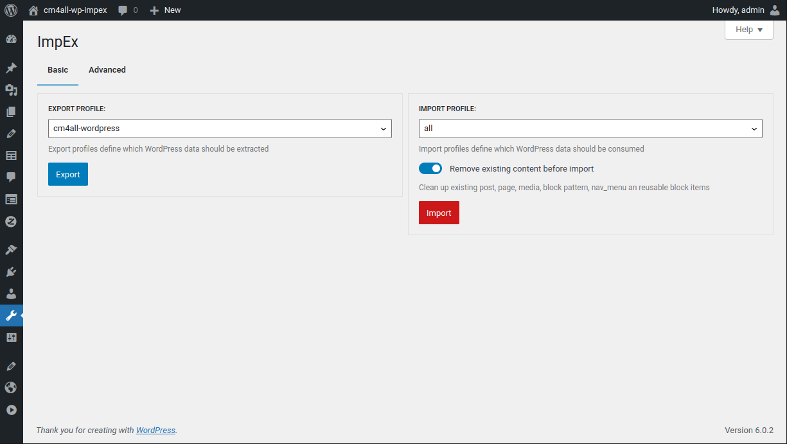
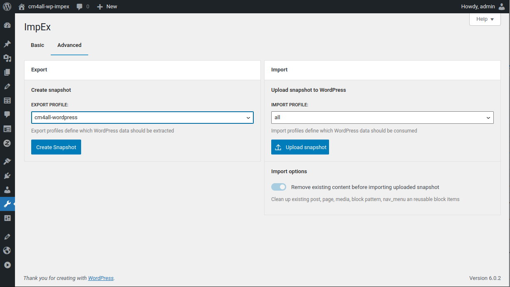

<!-- toc -->

# 2022-08

## Did you know : ImpEx can import / export [Elementor](https://elementor.com/) pages out of the box

ImpEx can import and export pages operated by [Elementor](https://elementor.com/).

[ImpEx](https://wordpress.org/plugins/cm4all-wp-impex/) is a free and fully open sourced WordPress Import/Export plugin.

## [Release 1.4.1](https://github.com/IONOS-WordPress/cm4all-wp-impex/releases/tag/1.4.1) 

- This release features a more user oriented UI simplifying the Import / Export : 

  

  - new additional import option to cleanup existing content (`post`, `page`, `media`, `block pattern`, `nav_menu` ans `reusable block` items) before processing the import data 

    
  - the local export folder name can be customized before download

  - watch a full video walkthroughh of the simple UI 

    <iframe width="560" height="315" src="https://www.youtube.com/embed/ReYMPwhUC7w" title="YouTube video player" frameborder="0" allow="accelerometer; autoplay; clipboard-write; encrypted-media; gyroscope; picture-in-picture" allowfullscreen></iframe>

- the (developer centric) ImpEx UI of previous ImpEx versions is also available in a second tab : 

   

- Import UI: if only a single Import profile exists, it is preselected

- Export UI: if only a single Export profile exists, it is preselected

- CLI [supports the new WordPress content cleanup option](./../../impex-cli.html#options-argument)

- PHP API: ImpEx [supports a 2 WordPress filters](./../../api/filters.html#wordpress-filters) to customize the available Import/Export profiles listed in the UI